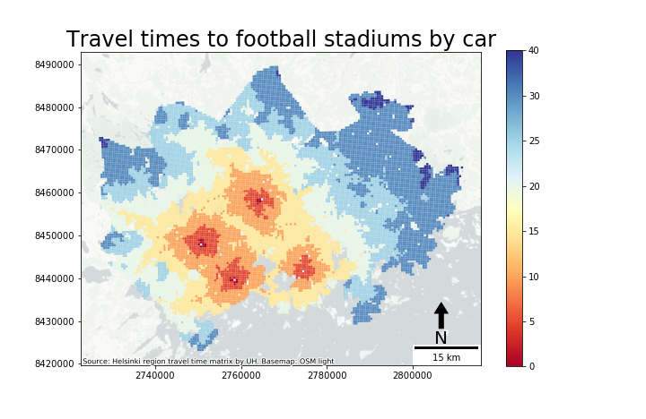

# GIS project course 2020

## Toolpack for mapping accessibility of sports facilities

### Aim of the project

* Combine LIPAS database of sports facilities with Helsinki Travel Time Matrix
* Produce raster files measuring the accessibility of different types of sports facilities in Helsinki Metropolitan area for further GIS analysis
* Visualise the accessibility of sports places with Python to have an idea of the results

### Input data: 

- [Helsinki Region Travel Time Matrix 2018](https://blogs.helsinki.fi/accessibility/helsinki-region-travel-time-matrix-2018/) (can be downloaded from the link), 
- YKR grid (can be downloaded from the link above), 
- [LIPAS data](https://www.lipas.fi/liikuntapaikat) for sports facilities (fetched using tool pack functions)

### Instructions for usage:

You can test and run the tool pack with `Demo_notebook.ipynb` example file in GitHub. However, due to large size of input files, you need to download the data to your local repository first. Download the Helsinki Region Travel Time Matrix and YKR grid data by clicking *the Travel Time Matrix link* above. Make sure you have a folder called "data" under the same folder where you are working. Place the YKR grid shapefile into the "data" folder. Be sure to add all 7 files that the YKR grid shapefile consists of. Then, unzip the Helsinki region travel time matrix data into "HelsinkiRegion_TravelTimeMatrix2018" folder under the data folder.  Do not alter the files or filepaths inside HelsinkiRegion_TravelTimeMatrix2018. After downloading the data, you can start using the functions found on `Main_code.py`.

### Analysis process and the functions

1. Define which types of sports facilities are you interested in and fetch the LIPAS data 
      1. `data/Codes_LIPAS.csv`
      2. `GetLipasData()` or `GetLipasUserFriendly()`
2. Locate in which YKR grid cells the sports facilities are with spatial join
      1. `CreateYkrList()`
3. Find the right travel time files based on YKR grid cell ids
      1. `FileFinder()`
4. Combine sport facility data to travel time matrix data and calculate the minimum travel times to closest facility from each cell with every transport method
      1. `TableJoiner()`
5. Save minimum travel times of each travel method into raster files for further use in GIS softwares
      1. `GeodataframeToTiff()`
6. Visualise the accessibility of sport facilities by chosen travel method by making a static or an interactive map
      1. `Visualiser()`
      2. `InteractiveMap()`

Here is a example of a map made with Visualiser:

